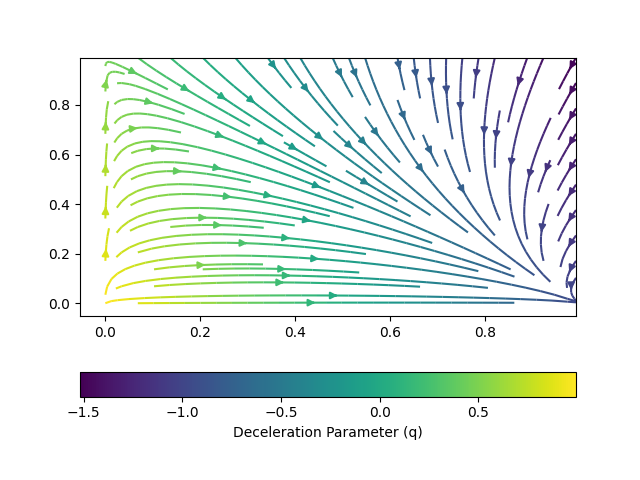

# Tesis UAQ. Ing Física
# Desarrollo de interfaz gráfica para visualización de modelos cosmológicos

Trabajo de tesis para obtener el titulo de Ingeniero Físico.

## Resumen

En este protocolo de tesis se habla sobre la necesidad de tener una herramienta
computacional que ayude a reducir la brecha entre entusiastas de la cosmología y el
conocimiento técnico que demanda el área, reduciendo tiempo de aprendizaje para
que el estudiante pueda seguir adelante, analizado otros temas en lugar de estancarse
en problemas técnicos que no aportan a su formación.

## Ejemplo de uso

En la imagen se muestra uno de los gráficos interactivos que podran generarse, de manera sencilla, mediante la interfaz

## Objetivos particulare

* Escoger la librería de programación más adecuada para el problema y los modelos
cosmológicos más importantes.
* Definir el método numérico con el que se resolveran las ecuaciones diferenciales
* Diseñar una estructura para la interfaz gráfica de manera que muestre en pantalla
la información relevante sobre el modelo, su gráfica de densidad y los botones para
modificar los parámetros; buscando que luzca estético.
* Realizar la documentación necesaria acerca del software que permita mantener un
desarrollo sostenible del software.

## Definición del Problema

El área de la cosmología cuenta con una fuerte componente matemática y de conceptos
físicos; sin embargo, es una de las áreas de la Física más trabajada entre aficionados y
profesionales del área. La creación de una interfaz de usuario para visualizar distintos
modelos cosmológicos funciona como un enlace entre el conocimiento técnico y la ciencia
a nivel de divulgación, esto sin olvidar su aplicación para fines de investigación o educación
formal. Siendo así, la única tarea del usuario final será el análisis y compresión del modelo
que está viendo en pantalla, sin tener que intervenir activamente en el desarrollo del
software

